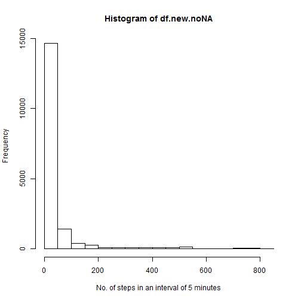

Loading data

```r
df = read.csv(file="activity.csv", header=TRUE)
head(df)
```

```
##   steps       date interval
## 1    NA 2012-10-01        0
## 2    NA 2012-10-01        5
## 3    NA 2012-10-01       10
## 4    NA 2012-10-01       15
## 5    NA 2012-10-01       20
## 6    NA 2012-10-01       25
```

```r
#df$date = as.Date(df$date)
#str(df)
```
  
Preprocessing data in order to have Dates as columns

```r
df.new = NULL
date.label = NULL
for(i in as.character(unique(df$date)))
{
  date.label = c(date.label, i)
  df.new = cbind(df.new, df$steps[which(df$date==i)])
}
colnames(df.new) <- date.label
df.new[1:4,1:4]
```

```
##      2012-10-01 2012-10-02 2012-10-03 2012-10-04
## [1,]         NA          0          0         47
## [2,]         NA          0          0          0
## [3,]         NA          0          0          0
## [4,]         NA          0          0          0
```
  
Frequency of number of steps in an interval of 5 minutes  

```r
hist(df.new, xlab="No. of steps in an interval of 5 minutes", ylab="Frequency")
```

 

Mean  

```r
as.matrix(apply(df.new, 2, function(x) round(mean(x,na.rm=TRUE),digits = 2)))
```

```
##             [,1]
## 2012-10-01   NaN
## 2012-10-02  0.44
## 2012-10-03 39.42
## 2012-10-04 42.07
## 2012-10-05 46.16
## 2012-10-06 53.54
## 2012-10-07 38.25
## 2012-10-08   NaN
## 2012-10-09 44.48
## 2012-10-10 34.38
## 2012-10-11 35.78
## 2012-10-12 60.35
## 2012-10-13 43.15
## 2012-10-14 52.42
## 2012-10-15 35.20
## 2012-10-16 52.38
## 2012-10-17 46.71
## 2012-10-18 34.92
## 2012-10-19 41.07
## 2012-10-20 36.09
## 2012-10-21 30.63
## 2012-10-22 46.74
## 2012-10-23 30.97
## 2012-10-24 29.01
## 2012-10-25  8.65
## 2012-10-26 23.53
## 2012-10-27 35.14
## 2012-10-28 39.78
## 2012-10-29 17.42
## 2012-10-30 34.09
## 2012-10-31 53.52
## 2012-11-01   NaN
## 2012-11-02 36.81
## 2012-11-03 36.70
## 2012-11-04   NaN
## 2012-11-05 36.25
## 2012-11-06 28.94
## 2012-11-07 44.73
## 2012-11-08 11.18
## 2012-11-09   NaN
## 2012-11-10   NaN
## 2012-11-11 43.78
## 2012-11-12 37.38
## 2012-11-13 25.47
## 2012-11-14   NaN
## 2012-11-15  0.14
## 2012-11-16 18.89
## 2012-11-17 49.79
## 2012-11-18 52.47
## 2012-11-19 30.70
## 2012-11-20 15.53
## 2012-11-21 44.40
## 2012-11-22 70.93
## 2012-11-23 73.59
## 2012-11-24 50.27
## 2012-11-25 41.09
## 2012-11-26 38.76
## 2012-11-27 47.38
## 2012-11-28 35.36
## 2012-11-29 24.47
## 2012-11-30   NaN
```

Median  

```r
as.matrix(apply(df.new, 2, function(x) round(median(x,na.rm=TRUE),digits = 2)))
```

```
##            [,1]
## 2012-10-01   NA
## 2012-10-02    0
## 2012-10-03    0
## 2012-10-04    0
## 2012-10-05    0
## 2012-10-06    0
## 2012-10-07    0
## 2012-10-08   NA
## 2012-10-09    0
## 2012-10-10    0
## 2012-10-11    0
## 2012-10-12    0
## 2012-10-13    0
## 2012-10-14    0
## 2012-10-15    0
## 2012-10-16    0
## 2012-10-17    0
## 2012-10-18    0
## 2012-10-19    0
## 2012-10-20    0
## 2012-10-21    0
## 2012-10-22    0
## 2012-10-23    0
## 2012-10-24    0
## 2012-10-25    0
## 2012-10-26    0
## 2012-10-27    0
## 2012-10-28    0
## 2012-10-29    0
## 2012-10-30    0
## 2012-10-31    0
## 2012-11-01   NA
## 2012-11-02    0
## 2012-11-03    0
## 2012-11-04   NA
## 2012-11-05    0
## 2012-11-06    0
## 2012-11-07    0
## 2012-11-08    0
## 2012-11-09   NA
## 2012-11-10   NA
## 2012-11-11    0
## 2012-11-12    0
## 2012-11-13    0
## 2012-11-14   NA
## 2012-11-15    0
## 2012-11-16    0
## 2012-11-17    0
## 2012-11-18    0
## 2012-11-19    0
## 2012-11-20    0
## 2012-11-21    0
## 2012-11-22    0
## 2012-11-23    0
## 2012-11-24    0
## 2012-11-25    0
## 2012-11-26    0
## 2012-11-27    0
## 2012-11-28    0
## 2012-11-29    0
## 2012-11-30   NA
```
  
Time-Series plot of 5 minute interval. For each interval, number of steps are averaged across all days

```r
meanVal = apply(df.new, 1, mean, na.rm=TRUE)
plot(x=1:length(meanVal), meanVal, type="l", col="red", xlab="Time points (5 minute Interval)", ylab="Avg. steps acoss days", xaxt="n")
axis(1, at = 1:length(meanVal), labels = seq(from=0, to=(length(meanVal)*5-1), by=5))
```

 
  
Number of steps are at peak at 104th interval. This can be observed from the time-series plot also.
  
Total number of rows with missing "steps" data

```r
length(which(is.na(df$steps)))
```

```
## [1] 2304
```
  
It would be good to fill these missing values. Among the suggested methods, replacing NA's with the mean of interval across all the days looks most reliable.
  
Iterating row wise and replacing any NA with the row mean

```r
df.new.noNA = df.new
for(j in 1:nrow(df.new.noNA))
{
  df.new.noNA[j,][is.na(df.new.noNA[j,])]=meanVal[j]
}
df.new.noNA[1:4,1:4]
```

```
##      2012-10-01 2012-10-02 2012-10-03 2012-10-04
## [1,]  1.7169811          0          0         47
## [2,]  0.3396226          0          0          0
## [3,]  0.1320755          0          0          0
## [4,]  0.1509434          0          0          0
```
  
Frequency of number of steps in an interval of 5 minutes (After replacing missing values)  

```r
hist(df.new.noNA, xlab="No. of steps in an interval of 5 minutes", ylab="Frequency")
```

 

Mean (After replacing missing values)  

```r
as.matrix(apply(df.new.noNA, 2, function(x) round(mean(x,na.rm=TRUE),digits = 2)))
```

```
##             [,1]
## 2012-10-01 37.38
## 2012-10-02  0.44
## 2012-10-03 39.42
## 2012-10-04 42.07
## 2012-10-05 46.16
## 2012-10-06 53.54
## 2012-10-07 38.25
## 2012-10-08 37.38
## 2012-10-09 44.48
## 2012-10-10 34.38
## 2012-10-11 35.78
## 2012-10-12 60.35
## 2012-10-13 43.15
## 2012-10-14 52.42
## 2012-10-15 35.20
## 2012-10-16 52.38
## 2012-10-17 46.71
## 2012-10-18 34.92
## 2012-10-19 41.07
## 2012-10-20 36.09
## 2012-10-21 30.63
## 2012-10-22 46.74
## 2012-10-23 30.97
## 2012-10-24 29.01
## 2012-10-25  8.65
## 2012-10-26 23.53
## 2012-10-27 35.14
## 2012-10-28 39.78
## 2012-10-29 17.42
## 2012-10-30 34.09
## 2012-10-31 53.52
## 2012-11-01 37.38
## 2012-11-02 36.81
## 2012-11-03 36.70
## 2012-11-04 37.38
## 2012-11-05 36.25
## 2012-11-06 28.94
## 2012-11-07 44.73
## 2012-11-08 11.18
## 2012-11-09 37.38
## 2012-11-10 37.38
## 2012-11-11 43.78
## 2012-11-12 37.38
## 2012-11-13 25.47
## 2012-11-14 37.38
## 2012-11-15  0.14
## 2012-11-16 18.89
## 2012-11-17 49.79
## 2012-11-18 52.47
## 2012-11-19 30.70
## 2012-11-20 15.53
## 2012-11-21 44.40
## 2012-11-22 70.93
## 2012-11-23 73.59
## 2012-11-24 50.27
## 2012-11-25 41.09
## 2012-11-26 38.76
## 2012-11-27 47.38
## 2012-11-28 35.36
## 2012-11-29 24.47
## 2012-11-30 37.38
```

Median (After replacing missing values)  

```r
as.matrix(apply(df.new.noNA, 2, function(x) round(median(x,na.rm=TRUE),digits = 2)))
```

```
##             [,1]
## 2012-10-01 34.11
## 2012-10-02  0.00
## 2012-10-03  0.00
## 2012-10-04  0.00
## 2012-10-05  0.00
## 2012-10-06  0.00
## 2012-10-07  0.00
## 2012-10-08 34.11
## 2012-10-09  0.00
## 2012-10-10  0.00
## 2012-10-11  0.00
## 2012-10-12  0.00
## 2012-10-13  0.00
## 2012-10-14  0.00
## 2012-10-15  0.00
## 2012-10-16  0.00
## 2012-10-17  0.00
## 2012-10-18  0.00
## 2012-10-19  0.00
## 2012-10-20  0.00
## 2012-10-21  0.00
## 2012-10-22  0.00
## 2012-10-23  0.00
## 2012-10-24  0.00
## 2012-10-25  0.00
## 2012-10-26  0.00
## 2012-10-27  0.00
## 2012-10-28  0.00
## 2012-10-29  0.00
## 2012-10-30  0.00
## 2012-10-31  0.00
## 2012-11-01 34.11
## 2012-11-02  0.00
## 2012-11-03  0.00
## 2012-11-04 34.11
## 2012-11-05  0.00
## 2012-11-06  0.00
## 2012-11-07  0.00
## 2012-11-08  0.00
## 2012-11-09 34.11
## 2012-11-10 34.11
## 2012-11-11  0.00
## 2012-11-12  0.00
## 2012-11-13  0.00
## 2012-11-14 34.11
## 2012-11-15  0.00
## 2012-11-16  0.00
## 2012-11-17  0.00
## 2012-11-18  0.00
## 2012-11-19  0.00
## 2012-11-20  0.00
## 2012-11-21  0.00
## 2012-11-22  0.00
## 2012-11-23  0.00
## 2012-11-24  0.00
## 2012-11-25  0.00
## 2012-11-26  0.00
## 2012-11-27  0.00
## 2012-11-28  0.00
## 2012-11-29  0.00
## 2012-11-30 34.11
```
  
Comparing Means, before and after fixing missing values

```r
meanBefore = as.matrix(apply(df.new, 2, function(x) round(mean(x,na.rm=TRUE),digits = 2)))
meanAfter = as.matrix(apply(df.new.noNA, 2, function(x) round(mean(x,na.rm=TRUE),digits = 2)))
plot(meanBefore, col="red", pch=1, xlab="Days", ylab="Means (Before and After)", ylim=c(0,100))
points(meanAfter, col="blue", pch=18)
legend(50,100,legend = c("Before", "After"), col = c("red","blue"), pch = c(1,18))
```

 

As observed in the plot, there is no change in the means of number of steps per day. Which means, no error/artifacts are intoduced. Only difference observed is the columns which had no data earlier now have some data.
  
  
Adding weekday/weekend information in the original data

```r
df = cbind(df, weekdays(as.Date(df$date)))
x = apply(df, 1, function(x) if(x[4]=="Saturday"|x[4]=="Sunday"){return("Weekend")}else{return("Weekday")})
df = cbind(df,x)
colnames(df)[4:5] <- c("Day","Day Category")
head(df)
```

```
##   steps       date interval    Day Day Category
## 1    NA 2012-10-01        0 Monday      Weekday
## 2    NA 2012-10-01        5 Monday      Weekday
## 3    NA 2012-10-01       10 Monday      Weekday
## 4    NA 2012-10-01       15 Monday      Weekday
## 5    NA 2012-10-01       20 Monday      Weekday
## 6    NA 2012-10-01       25 Monday      Weekday
```
  
Since, I am working with the processed data (df.new and df.new.noNA). I will use day information with the same.

```r
days <- weekdays(as.Date(colnames(df.new.noNA)))
weekendIndex <- which(days=="Saturday"|days=="Sunday")
weekdayIndex <- which(days!="Saturday"&days!="Sunday")

meanValWeekday = apply(df.new.noNA[,weekdayIndex], 1, mean, na.rm=TRUE)
meanValWeekend = apply(df.new.noNA[,weekendIndex], 1, mean, na.rm=TRUE)
par(mfrow=c(2,1))
plot(x=1:length(meanValWeekday), meanValWeekday, type="l", col="blue", xlab="Time points (5 minute Interval)", ylab="Avg. steps acoss Weekdays", xaxt="n", ylim=c(0,250))
axis(1, at = 1:length(meanValWeekday), labels = seq(from=0, to=(length(meanValWeekday)*5-1), by=5))
plot(x=1:length(meanValWeekend), meanValWeekend, type="l", col="blue", xlab="Time points (5 minute Interval)", ylab="Avg. steps acoss Weekends", xaxt="n", ylim=c(0,250))
axis(1, at = 1:length(meanValWeekend), labels = seq(from=0, to=(length(meanValWeekend)*5-1), by=5))
```

 
